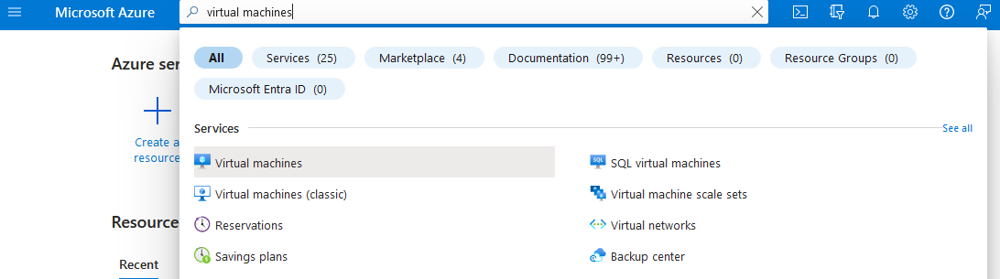
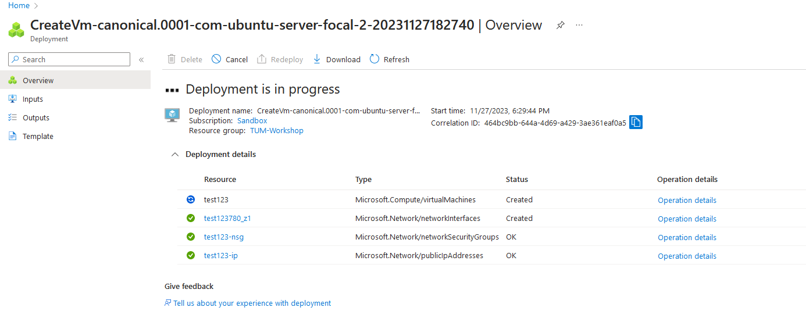

# Introduction

In this workshop you will gain hands on experience with the cloud.
The cloud lets us build traditional IT architectures (Virtual Machines, Databases, Networks) more easily and faster than in an on-premise environment. \
Additionally the cloud offers us possibilities to build new types of architectures, e.g. serverless functions. 
A serverless function is a piece of code that does not require us to create an underlying virtual machine or container to run. 
Therefore, we can focus on developing the actual function code instead of worrying about the server infrastructure.

This session consists of two parts:
* In the first part, we will provision a virtual machine from the Azure portal.
* In the second part, we deploy an Azure function app using [Terraform](https://terraform.io) to build a simple cloud native application.

# Part 1

The first contact point with the cloud is done by visiting the [Azure portal](https://portal.azure.com) with your web browser.

We will provide you with login credentials.

## Provision a Virtual Machine

After you have successfully logged in to the Azure portal feel free to browse around a bit.

To provision a VM in Azure, simply search for **Virtual machines** in the searchbar.



Next, press the **Create** Button on the top left and chose **Azure virtual machine**

You are presented with a long list of options to customize your virtual machine. We will go with a simple small Linux machine.

Please set the following options:
* Resource group: **TUM-Workshop**
* Virtual machine name: *choose any unique name*
* Size: **B2s** -> press **See all sizes** and choose from the list. Please do not provision an expensive VM :)
* Leave all other options on default value

Now click **Review + create** at the bottom. (Ignore Deployment recommendations popup)

Take a few seconds to review your VM options.
When you are ready press **Create**.

Azure automatically creates a new key pair for you.
This key is used to SSH to your new VM. \
Press **Download private key and create resource**



While your VM is deploying, you can already open your SSH client of choice and import your private key.

After Deployment is finished press **Go to resource**. \
You now see an overview of your deployed VM resource with details on the network, disk, OS, etc.

Congratulations! You have successfully deployed your virtual machine in the public cloud!

## Connect to the Virtual Machine

Go to your VM resource overview and press **Connect** at the top.

Select **Native SSH** and follow the instructions to connect to the VM with via its public IP address.

If you did everything correct, you will be greeted by this login shell page:

```
Welcome to Ubuntu 20.04.6 LTS (GNU/Linux 5.15.0-1050-azure x86_64)

 * Documentation:  https://help.ubuntu.com
 * Management:     https://landscape.canonical.com
 * Support:        https://ubuntu.com/advantage

  System information as of Mon Nov 27 17:39:57 UTC 2023

  System load:  0.08              Processes:             115
  Usage of /:   5.2% of 28.89GB   Users logged in:       0
  Memory usage: 7%                IPv4 address for eth0: 10.1.0.4
  Swap usage:   0%


Expanded Security Maintenance for Applications is not enabled.

0 updates can be applied immediately.

Enable ESM Apps to receive additional future security updates.
See https://ubuntu.com/esm or run: sudo pro status

The list of available updates is more than a week old.
To check for new updates run: sudo apt update


The programs included with the Ubuntu system are free software;
the exact distribution terms for each program are described in the
individual files in /usr/share/doc/*/copyright.

Ubuntu comes with ABSOLUTELY NO WARRANTY, to the extent permitted by
applicable law.

/usr/bin/xauth:  file /home/azureuser/.Xauthority does not exist
To run a command as administrator (user "root"), use "sudo <command>".
See "man sudo_root" for details.

azureuser@tum-workshop-vm:~$
```

Congratz! You are now connected to your VM!

## Resize VM

tbd.

## Destroy VM

tbd.

## Conclusion

In part 1 of this workshop, you got a first practical feel for the public cloud.\
You provisioned your own virtual machine and connected to it via SSH.

The Azure portal offers a great way to quickly create resources and get an overview of your deployed architecture. Feel free to continue exploring the portal throughout the remaining workshop.

 # Part 2

In a real production environment however, you will rarely create resources via the Azure portal. 
This is due to the fact that manually clicking in a WebUI is prone to errors and inconsistency.

Instead, we use Infrastructure as Code (IaC) to provision our resources.
One of the main players on the market for IaC is [Terraform](https://terraform.io).

You do not need to fully understand the ```terraform/*.tf``` files in this repository, but please take 2 minutes to browse the files and have a look at their content. \
Notice that these files define so called ```resources```.
Each resource represents a single component (e.g. a virtual machine) of our cloud architecture.

To deploy these resources to the cloud, we use a simple Github Actions pipeline defined in ```.github/workflows/tf-apply.yml```.

The main component of our defined architecture is an **Azure function App**, which is a serverless function that executes simple python code in the cloud and can be triggered via HTTP request.

Your task is to deploy the infrastructure and play around with the code of your Azure function.

## Deploying the cloud Resources

tbd.